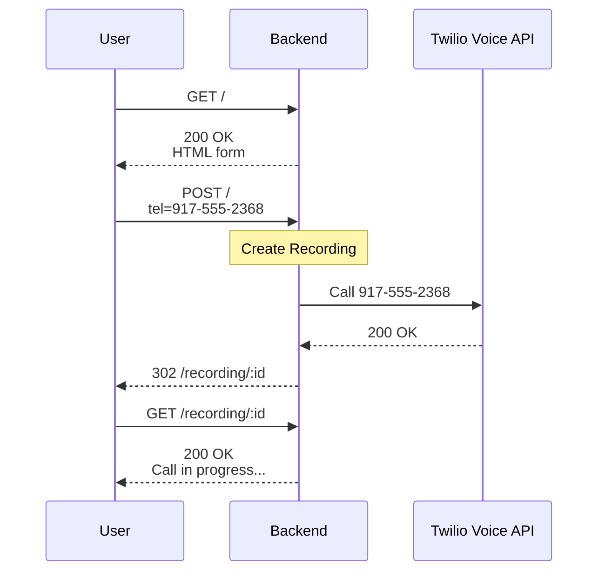
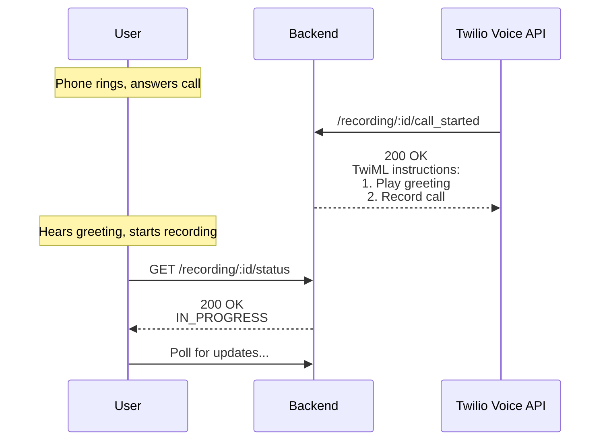
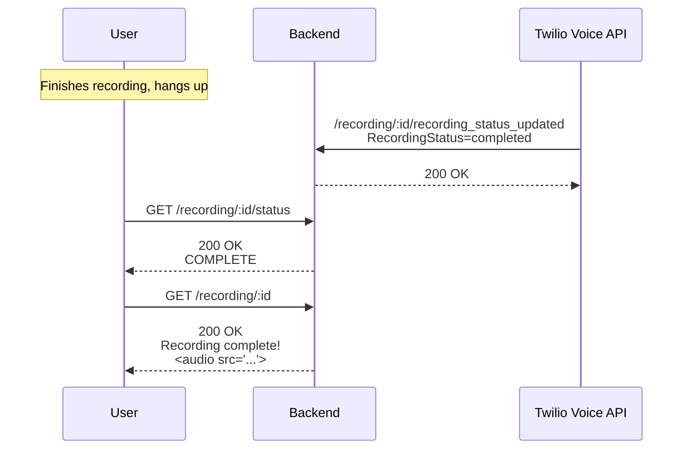

Storyworth Voice Recordings
===========================

My attempt at Storyworth's take-home assigment:

> Some Storyworth Memoir storytellers do not take to typing their stories, whether because they are uncomfortable with technology or because they are better speakers than writers.  We want to add a feature to let storytellers record a story by phone.
>
> The storyteller will see a landing page that asks them to enter their phone number (design in Figma below).
>
> Upon submitting their phone number, the storyteller should receive an automated call asking them to record a story.
>
> Once they’ve recorded their story, they should be redirected to a page with an audio player to listen to their recording.

Local development
-----------------

First, install [uv](https://docs.astral.sh/uv/). Then:

    # Install dependencies
    uv sync

    # Run migrations
    uv run ./manage.py migrate

    # Run tests
    uv run pytest

Request flow
------------

### Starting a call

### Recording

### Ending the call

